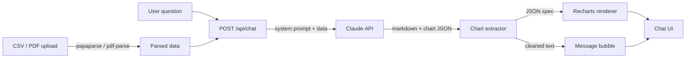

# Financial Data Analyst — Chat with your CSV, get charts back

> **Drop a CSV or PDF of your financial data, ask a question, and Claude answers with plain-English analysis AND a live Recharts visualisation — line, bar, pie, area, scatter, or radar, picked automatically.**

<p align="center"></p>

<p align="center">
  
  
  
  
  
</p>

## Why this exists

Every "AI-for-finance" tool I tried either hallucinated the numbers or gave me a wall of text I still had to eyeball. This one keeps the data structured: the CSV/PDF is parsed client-side, Claude gets the actual rows plus your question, and instead of just prose it emits a fenced ```chart``` JSON block that the UI renders inline with Recharts. So the answer to "which quarter had the biggest revenue jump?" isn't a paragraph — it's a bar chart with the number highlighted, generated in the same conversation.

## Try it in 60 seconds

```bash
git clone https://github.com/Danush-Aries/financial-data-analyst.git
cd financial-data-analyst
npm install

cp .env.example .env.local             # add ANTHROPIC_API_KEY
npm run dev                            # http://localhost:3000
```

## How it works

- **File ingestion** — `papaparse` for CSVs, `pdf-parse` for PDFs; the first ~20 rows are shown as a data preview so the user sees exactly what Claude sees.
- **Financial system prompt** — instructs Claude to prefer KPIs (percentages, deltas, anomalies, specific numbers) over generic prose, and to embed a ```chart``` fenced block whenever a visualisation would clarify the answer.
- **Chart extractor** — scans the streamed response for fenced `chart` blocks, parses the JSON spec, splits the message into text + chart parts, and renders both in the same bubble.
- **`ChartRenderer.tsx` dispatcher** — one component that switches on `spec.type` and dispatches to the right Recharts primitive (Line / Bar / Pie / Area / Scatter / Radar). Adding a new chart type is a single case.
- **Export to image** — `html-to-image` snapshots any rendered chart to PNG for pasting into a deck.



## Screenshots

| Chat with a CSV | Auto-generated bar chart | PDF ingest + summary |
|---|---|---|
|  |  |  |

## Example prompts

- *"What were the top 3 revenue months last year and how did they trend?"*
- *"Compare expenses across categories — which one grew fastest?"*
- *"Plot revenue vs cost per quarter."*
- *"Find any anomalies in this monthly burn rate."*

## Environment

| Variable | Required | Description |
|---|---|---|
| `ANTHROPIC_API_KEY` | Yes | Get it at [console.anthropic.com](https://console.anthropic.com) |

## Project structure

```
├── app/
│   ├── api/chat/route.ts   # Claude API route with financial system prompt
│   ├── page.tsx            # Main chat UI + file upload + data preview
│   ├── layout.tsx          # Root layout
│   └── globals.css         # Tailwind base + CSS variables
├── components/
│   ├── FileUpload.tsx      # Drag-drop CSV / PDF
│   ├── DataTable.tsx       # Preview parsed rows
│   └── ChartRenderer.tsx   # Recharts dispatcher (line / bar / pie / area / scatter / radar)
└── lib/
    └── fileParser.ts       # CSV (papaparse) + PDF (pdf-parse) parsers
```

## Stack

Next.js 14 (App Router) · TypeScript · `@anthropic-ai/sdk` · Recharts · Tailwind CSS + Radix UI · lucide-react icons · `papaparse` + `pdf-parse` · `html-to-image`.

## Contributing

PRs welcome. New chart types go in `components/ChartRenderer.tsx` (one `case` in the dispatcher + a Recharts primitive). New file formats plug into `lib/fileParser.ts` — return `{ headers: string[], rows: object[] }` and the rest of the pipeline just works.

## License

MIT — see [LICENSE](./LICENSE).

---

### More from Danush

- [ponytail-for-python](https://github.com/Danush-Aries/ponytail-for-python) — code intelligence for Python codebases
- [Agentic_Systems](https://github.com/Danush-Aries/Agentic_Systems) — reference implementations of agent patterns
- [autonomous-coding-agent](https://github.com/Danush-Aries/autonomous-coding-agent) — full-auto engineering agent
- [computer-use-agent](https://github.com/Danush-Aries/computer-use-agent) — Claude drives your desktop via VNC
- [browser-automation-agent](https://github.com/Danush-Aries/browser-automation-agent) — Claude drives Playwright
- [blinkchat](https://github.com/Danush-Aries/blinkchat) — realtime chat with vibes
